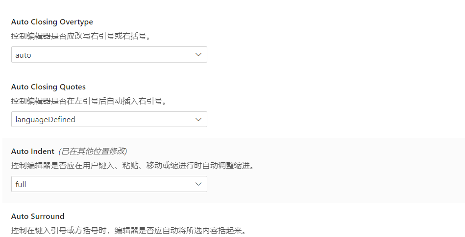

> spring的源码就是秉持着封装和隔离，也就是高内聚和低耦合（单一职责）大部分使用继承实现，一个子类只负责一件事情，通过层层继承来分类职责
> 

### 事务

> 一般而言使用@Transactional(rollbackFor = Exception.class) 标示的本地事务，https://segmentfault.com/a/1190000013341344
> 

### 1. 事务与多数据源的失效

> 使用dynamic-datasource-spring-boot-starter 发生的多数据源失效问题
> 

使用事务时，spring会保证事务内的代码只有一个connection连接，所有多数据源会失效， 解决办法有两种，一种是在与多数据源的同级类上，添加事务的传播机制为创建新的子事务，那么在执行类的方法时会重新创建子事务

## 源码学习感悟技巧：

> 代码是真的绕，什么垃圾玩意，继承能搞这么多的，还不如搞成多继承，省的他搞多级继承，一层一层继承下去
> 

### 1. context

> 用于操作和组合上下文操作的基类
> 

beanFactory，reader，source 这些都是一个个的名词类，例如beanFacotory就只是一个工厂，用来获取而已，reader是用来读取，source是资源文件，扩展类，这些大类各司其职，他们就是一个个的工具扳手，需要有一个人来用他们，而context就是这个人，它提供了整合各个操作的能力，并且包含了所有的ioc组件，在refresh方法中进行真正的spring容器启动。而且也兼具了用户使用的功能，像beanFacotory和reader这些类，外部是不需要知道的，只需要知道applicationContext就可以了。因为用户肯定是需要用到beanFacotry获取bean之类的方法的，所以`applicationContext` 也继承了beanFacotory类，这样外部就可以通过applicationContext访问bean了。确实是秒：

1. 首先实现beanFacotry,reader，source等一些组件方法
2. 然后实现`applicationContext` 大集合操作类，并且让applicationContext继承beanfacotry方便调用，接着在applicationContext中进行所有的操作。

### 2. `InitializingBean`，`DisposableBean`

> 通过实现这两个接口可以在bean的初始化之后和销毁时做一些事情
> 

这里的实现很有意思，首先动作肯定是由context发出的，看到这里就发现所有针对spring做的操作都是由applicationContext发出的。

spring需要兼容两种初始化方式，一种xml形式和一种实现接口的形式，这些配置都会在初始化的时候放入beanDefinition中，也就是bean的定义中，然后在bean工厂创建bean的时候执行初始化方法。

而`DisposableBean` 销毁也是同理都是读取beanDefinition的时候就已经初始化元数据信息了，然后在初始化bean的时候会将实现了`DisposableBean` 和xml配置了销毁方法的bean包装成适配器对象放进一个map中，适配器也是一个`DisposableBean` 对象，然后`applicationContext` 会调用钩子方法，最后销毁对象。这里的包装器很有意思。a是一个关闭对象，b不是一个关闭对象但是有关闭方法，他们都可以包装成关闭对象C，然后系统只需要操纵对象C就好了。

### 3. awear感知对象

> 搞一个标记接口，搞几个需要感知具体对象的接口，所有bean在初始化的时候，spring会通过感知类将当前上下文的信息传递给该bean
> 

这一部分就比较简单，某一个bean在初始化的时候只要继承了aware接口，spring就可以将一些信息传递给该bean，其中applicationContext是通过注册了一个beanProcessor,然后让processor在每个bean初始化之后传入applicationContext，其实都可以用beanProcessor，因为beanProcessor已经定义了bean初始化前和初始化后可以执行的行为。

### 4. facotryBean和原型

> facotryBean就是可以包装bean，然后通过名称获取的时候获取的是包装的obj而不是facotoryBean，原型模式就是通过名称获取的时候通过beanDefinition判断是否是原型模式，是的话直接返回，每次获取都会从新new一次对象
> 

这里facotoryBean的实现就是搞了一个包装类，搞了一个支撑接口，接口继承单例注册的类，然后在进行获取bean的时候转换一下，如果是facotrybean的话，就获取支撑接口中存储的bean，不是直接获取单例bean

1. 将自定义的ApplicationListener注册为一个Bean，Spring再初始化Bean之后会添加，具体代码在ApplicationListenerDetector#postProcessAfterInitialization，判断一个Bean如果是ApplicationListener，则也是使用context.addApplicationListener添加；
2. 使用注解@EventListener，在初始化Bean之后，会在EventListenerMethodProcessor中进行处理和添加；

```java
private void processBean(final String beanName, final Class<?> targetType) {
  ....
  // 获取public 且有@EventListener的方法
  AnnotatedElementUtils.findMergedAnnotation(method, EventListener.class));
  ...
  ApplicationListener<?> applicationListener = factory.createApplicationListener(beanName, targetType, methodToUse);
  // 添加监听器
  context.addApplicationListener(applicationListener);
}
```

### 5. 事件模型

> spring实现的观察者模式
> 


applicationContext中包含一个`ApplicationEventMulticaster` ，它有一个抽象类，扫描bean的时候会将标注了注解的类或方法类放进抽象类的listener中，当有一个事件发布过来的时候就会调用该类进行事件分给监听器。

**到此为止吧！这个博文写的太垃圾了，脑壳痛。**

1. 如果希望将存储放在子类，而由父类实现接口的通用方法时，可以利用一个模板方法让子类实现，这样父类就可以通过模板方法拿到实例，然后根据实例实现一些通用的方法，这样一些子类才能实现的方法就可以放入父类中，减轻子类的代码。例如：


1. `ApplicationContext` 就是最大的beanFactory，或者说IOC容器，通过这个类可以获取到所有跟IOC有关的方法

  
