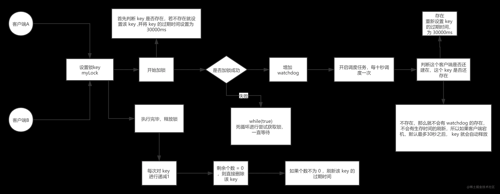

# 分布式锁

>分布式锁是一种用于在分布式系统中实现互斥访问的机制。在分布式系统中，多个节点并发地访问共享资源时，为了避免数据竞争和保证数据的一致性，需要对共享资源进行加锁操作，以确保在同一时间只有一个节点能够访问该资源

**分布式锁的定义包括以下几个关键要素：**

* 互斥性：分布式锁保证在任意时刻只有一个节点能够获得锁，其他节点必须等待。
* 容错性：分布式锁需要能够处理节点故障或网络分区等异常情况，确保在出现故障时锁能够被正确释放或重新获取。
* 一致性：分布式锁需要保证在任意时刻只有一个节点能够获得锁，避免多个节点同时访问共享资源导致数据不一致。
* 高性能：分布式锁需要具备高性能，能够在高并发的情况下快速响应和处理锁的获取和释放操作。

常见的分布式锁实现方式包括使用基于数据库的锁、基于共享存储的锁（如ZooKeeper）、基于Redis的锁等。这些实现方式都通过协调多个节点之间的通信和状态来实现分布式锁的功能。

## 采用redis实现的分布式锁

### 1. redis的setNx

> 使用redis的setNx没有就添加进行互斥操作，因为redis天生的单线程处理，所以可以作为作为锁
**版本1：**
```java
    /**
     * 测试redis锁，只是简单的使用setnx加过期时间实现
     * 这种方式有一个问题，如果获取锁的线程执行时间超长，导致锁过期，其他线程获取到锁，这时候原来的线程执行完了，会删除掉其他线程的锁
     */
    private void testRedis() {
        //这里如果没有设置时间，当服务器获取锁之后宕机会造成死锁
        boolean lock = redissonClient.getBucket("lock").setIfAbsent("1", Duration.ofSeconds(1));
        if (lock) {
            log.info("线程{}获取锁成功", Thread.currentThread().getName());
            //do sh
            ThreadUtil.sleep(2000);
            boolean lock1 = redissonClient.getBucket("lock").delete();
            if (lock1)
                log.info("线程{}释放锁成功", Thread.currentThread().getName());
            else
            // 这里会释放失败，会释放别人的锁
                log.error("线程{}释放锁失败", Thread.currentThread().getName());
        } else {
            log.info("线程{}获取锁失败,睡一会", Thread.currentThread().getName());
            ThreadUtil.sleep(1000);
            testRedis();
            log.info("线程{}睡醒了", Thread.currentThread().getName());
        }
    }
```

**缺点：**
如果获取锁的线程执行时间过长，而锁过期释放了，此时释放锁会释放别人的锁

**版本2：** 每个线程在获取锁时增加唯一标识，释放锁时进行唯一标识的判断，如果锁已经不是自己持有就不用释放
```java
    private void testRedis1() {
            //使用uuid作为标识，防止误删其他线程的锁
            UUID uuid = UUID.fastUUID();
            RBucket<Object> lock = redissonClient.getBucket("lock");
            boolean success = lock.setIfAbsent(uuid, Duration.ofSeconds(1));

            if (success) {
                log.info("线程{}获取锁成功", Thread.currentThread().getName());
                //释放锁
                if (uuid.equals(lock.get())) {
                    boolean lock1 = lock.delete();
                    if (lock1)
                        log.info("线程{}释放锁成功", Thread.currentThread().getName());
                }
            } else {
                log.info("线程{}获取锁失败,睡一会", Thread.currentThread().getName());
                ThreadUtil.sleep(1000);
                testRedis();
                log.info("线程{}睡醒了", Thread.currentThread().getName());
            }
        }
```
版本2已经可以实现只释放自身获取的锁了，但是版本2依旧有一个问题，那就是判断是一次操作，释放又是另一个操作，两个操作并不是原子性的，如果在判断的时候是当前线程的锁，此时有线程去获取锁，那么线程去释放时，依旧会释放掉别人的锁。

**版本3：** 使用lua脚本进行原子操作，redis是单线程的，只需要保证批量操作就可以实现原子性，lua脚本可以实现发送批量的redis操作

```lua
if redis.call('get', KEYS[1]) == ARGV[1] then
    return redis.call('del', KEYS[1])
else
    return 0
end
```

```java
    //释放锁
RScript script = redissonClient.getScript();
String lua = IoUtil.read(FileUtil.getReader("lua/unlock.lua", "utf-8"));
//此时判断和释放已经是原子操作了
Object eval = script.eval(RScript.Mode.READ_WRITE, lua, RScript.ReturnType.BOOLEAN, Arrays.asList("lock"), uuid.toString());
if (Boolean.TRUE.equals(eval)) {
    log.info("线程{}释放锁成功", Thread.currentThread().getName());
} else {
    log.info("线程{}释放锁失败", Thread.currentThread().getName());
}
```

### 2. 使用hash优化锁

> 上面已经实现了分布式锁的基本功能，可以锁资源，并且只会释放自身的锁，但是一个成熟的锁还有两个问题要解决:**可重入**和**锁续期**,而想要实现这两个操作，单纯的使用setNx就实现不了。

**版本4：** 需要使用到hash表，设置一个hash表，key就是标识，value是重入次数，使用lua脚本，当不存在lock的hash或者hash的key是自己的时候，就将hashvalue+1，释放同理-1，小于0时删除key，这样就实现了重入机制

```java

    /**
     * 使用setnx实现分布式锁
     * 1.加过期时间，防止死锁
     * 2.使用标识，防止误删其他线程的锁
     * 3.使用lua脚本，保证判断标识和删除操作是原子操作
     * 4.优化为使用map存储，key为标识，value为重入次数，优化为可重入锁
     */
    private void testRedis3(String key) {
        //使用uuid作为标识，防止误删其他线程的锁
        String uuid = key == null ? UUID.fastUUID().toString(): key;

        if (Boolean.TRUE.equals(tryLock(uuid))) {
            log.info("线程{}获取锁成功", Thread.currentThread().getName());
//            ThreadUtil.sleep(1000);

            if (Boolean.TRUE.equals(tryLock(uuid))) {
                log.info("线程{}重入锁成功", Thread.currentThread().getName());
                if (Boolean.TRUE.equals(unLock(uuid))) {
                    log.info("线程{}释放锁成功", Thread.currentThread().getName());
                } else {
                    log.info("线程{}释放锁失败", Thread.currentThread().getName());
                }

            } else {
                log.info("线程{}重入锁失败", Thread.currentThread().getName());
            }

            if (Boolean.TRUE.equals(unLock(uuid))) {
                log.info("线程{}释放锁成功", Thread.currentThread().getName());
            } else {
                log.info("线程{}释放锁失败", Thread.currentThread().getName());
            }

        } else {
            log.info("线程{}获取锁失败,睡一会", Thread.currentThread().getName());
            ThreadUtil.sleep(1000);
            testRedis3(uuid);
        }
    }

    private boolean tryLock(String uuid) {
        RScript script = redissonClient.getScript();
        String lua = IoUtil.read(FileUtil.getReader("lua/HashLock.lua", "utf-8"));
        Object success = script.eval(RScript.Mode.READ_WRITE, lua, RScript.ReturnType.BOOLEAN, Arrays.asList("lock"), uuid);
        return Boolean.TRUE.equals(success);
    }

    private boolean unLock(String uuid) {
        RScript script = redissonClient.getScript();
        String lua1 = IoUtil.read(FileUtil.getReader("lua/HashUnLock.lua", "utf-8"));
        Object unLock = script.eval(RScript.Mode.READ_WRITE, lua1, RScript.ReturnType.BOOLEAN, Arrays.asList("lock"), uuid.toString());
        return Boolean.TRUE.equals(unLock);
    }
```
**版本5：** 锁延期，定义一个线程，在过期时间的一部分时间内进行续期

## 使用ab进行测试

循环一百次，每次创建一个线程执行，线程进行20次并发操作，从三个微服务中进行负载均衡，随机选择url，初始count为1，执行完请求后，结果为一个错误数字，说明在并发情况下，使用java的本地锁没有效果，而使用分布式锁的情况下可以保证多个服务的串行话。
```sh
# 定义URL列表
urls=("http://192.168.40.15:8080/testLock" "http://192.168.40.15:8081/testLock" "http://192.168.40.15:8082/testLock")

# 循环执行100次请求
for ((i=1; i<=100; i++))
do
  # 随机选择一个URL
  random_url=${urls[$RANDOM % ${#urls[@]}]}
  
  # 发起20个并发请求，并将请求发送到后台执行
  ab -n 20 -c 20 "$random_url" &
done

# 等待所有后台请求执行完成
wait
```
```java
    //非原子性的redis自增
    private synchronized void extracted() {
            Object count = redisson.getBucket("count").get();
            System.out.println("hello world");
            if (Objects.isNull(count)) {
                count = 1;
            }

            redisson.getBucket("count").set((Integer) count + 1);
    }
    //原子性自增
     private void extracted1() {
        //自增count 序列
        long count1 = redisson.getAtomicLong("count").incrementAndGet();
        System.out.println("当前count值为：" + count1);
    }
```

## redisson锁实现原理
[原理博客](https://juejin.cn/post/6901951315962757134)
> 其实redisson的原理与上面写的一样，也是利用大量的lua脚本进行配置，每个redisson客户端都有一个manager来确定唯一标识，通过uuid：线程id来确定进行唯一标识，然后hash的value为数值，可重入时就进行自增，可能就是多了一个看门狗机制进行续期。

### 普通锁

**获取锁：** 尝试获取锁，如果获取失败就会进入一个死循环中再次获取锁，如果还是失败就会阻塞等待超时时间的剩余时间，**直到监听到对应的锁释放事件**此时会再次尝试获取锁
```lua
-- 判断是否存在hash，不存在设置一个hash锁，重入为1
if (redis.call('exists', KEYS[1]) == 0) then 
redis.call('hincrby', KEYS[1], ARGV[2], 1); 
redis.call('pexpire', KEYS[1], ARGV[1]); 
return nil; 
end; 
-- 如果存在把重入值加1，重新设置超时时间
if (redis.call('hexists', KEYS[1], ARGV[2]) == 1) then 
redis.call('hincrby', KEYS[1], ARGV[2], 1); 
redis.call('pexpire', KEYS[1], ARGV[1]);
return nil; 
end; 
-- 否则获取锁失败，返回剩余的超时时间
return redis.call('pttl', KEYS[1]);
```
**看门狗：** 就是一个异步线程，当线程获取锁的时候开启，线程会每个30秒进行一次续期动作，也是利用上面的续期lua脚本进行配置，感觉一般是用不上的，默认是30秒执行一次，如果客户端宕机了，那么看门狗线程下线，锁也会释放掉

**释放锁：** 释放获取的锁也是执行对应的lua脚本，找到对应的锁，如果是当前线程获取锁，那么就对value值减一，如果value值为0，那就直接删除hash，**并且发布一条释放锁的消息给所有的订阅者**如果不等于0的话，会刷新一次过期时间。
```java
                        "if (redis.call('hexists', KEYS[1], ARGV[3]) == 0) then " +
                        "return nil;" +
                        "end; " +
                        "local counter = redis.call('hincrby', KEYS[1], ARGV[3], -1); " +
                        "if (counter > 0) then " +
                        "redis.call('pexpire', KEYS[1], ARGV[2]); " +
                        "return 0; " +
                        "else " +
                        "redis.call('del', KEYS[1]); " +
                        "redis.call('publish', KEYS[2], ARGV[1]); " +
                        "return 1; " +
                        "end; " +
                        "return nil;",
      Arrays.asList(getName(), getChannelName()), LockPubSub.UNLOCK_MESSAGE, internalLockLeaseTime, getLockName(threadId));
```

**主动尝试获取锁：** redisson提供主动尝试获取锁，如果在超时时间内没有获取锁就直接放弃，如果获取锁超过过期时间，直接释放锁 ```java boolean res = lock.tryLock(100, 10, TimeUnit.SECONDS);``` 这种情况是不会启动看门狗的

  

### 公平锁
> 获取锁的先后顺序严格按照先到先得的顺序，一般都是通过一个等待队列

```java
        RLock fairLock = redisson.getFairLock("anyLock");
        // 最常见的使用方法
        fairLock.lock();
```


