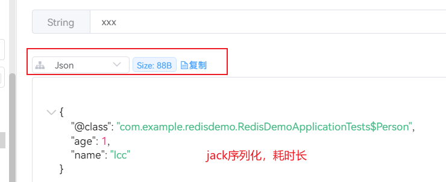
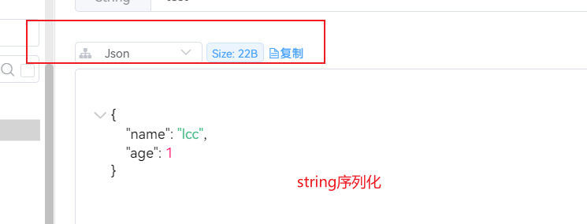

# 对redisson各种编码格式的存储空间测试

### 序列化格式：

> 项目中使用redisson时发现存放在redis中的缓存数据老是有乱码的前缀，最后发现是由于编码格式的问题，redisson中的默认序列化是```MarshallingCodec```,这是jboss提供的序列化机制，新版已经废弃掉了，就是因为序列化的结果不可读。后续的默认序列化起为```JsonJacksonCodec```

**JsonJacksonCodec：** 序列化可以直接将对象序列化保存，保存的不是字符串，因为是对象，所以会保存许多的对象信息，导致体积较大，同一个对象比字符串序列化打了4倍，而且这种序列化不可控，所以最好也不要采用。
  
  


**StringCodec：** 这种序列化就是纯字符串序列化，这种各个客户端识别更好，没有那么多序列化坑，推荐

### 关于在使用springboot-start时如何进行配置

下面的代码是yaml引用对象的格式
**配置文件：**
```yaml
    redisson:
      config:
        codec: 
        # 对象的类型
          class: org.redisson.codec.JsonJacksonCodec
          # 对象的实例
          instance: INSTANCE
        # yml的引用对象格式，与上面的yaml完全不同
          codec: !<org.redisson.codec.JsonJacksonCodec> {}
```

**代码配置：** 代码里面是不能配置的，因为redisson在执行的时候是获取connectManager，而connectManager只有初始化的时候可以进行配置，即使拿到redisson客户端设置config也是无效的，代码想要实现其他编码格式需要再获取command对象时直接传入编码格式
